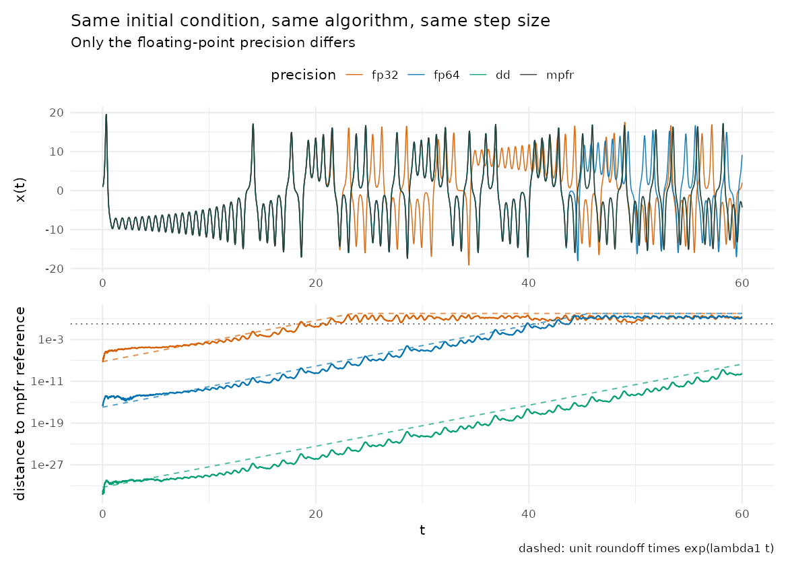
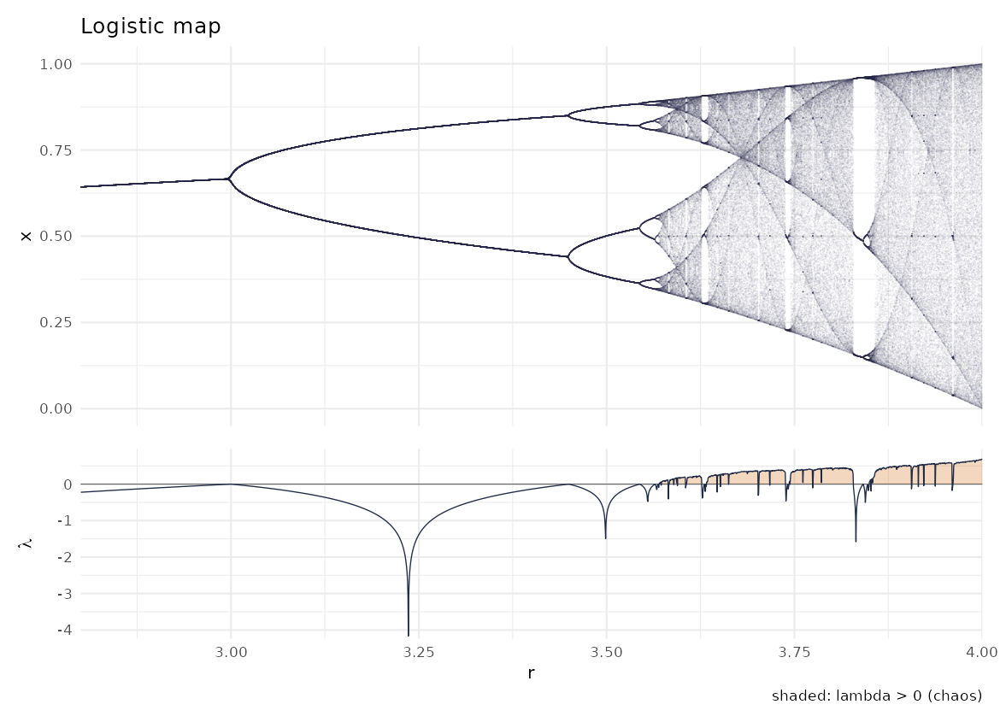
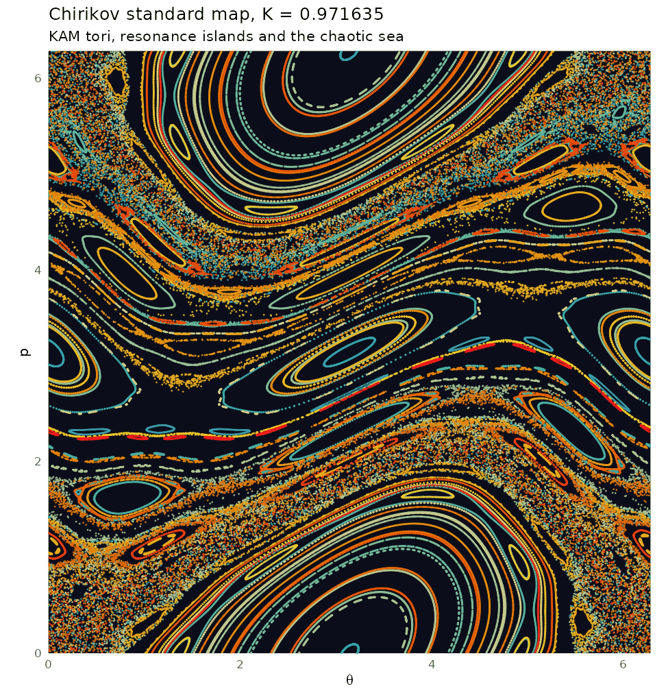
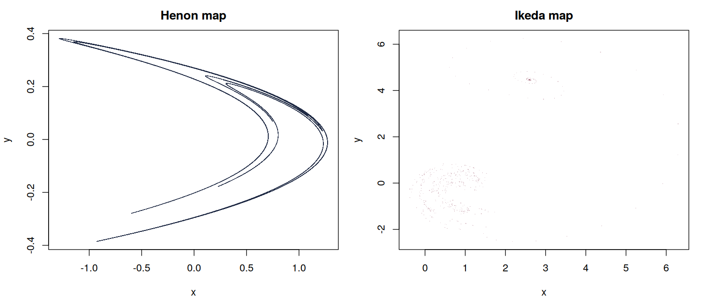
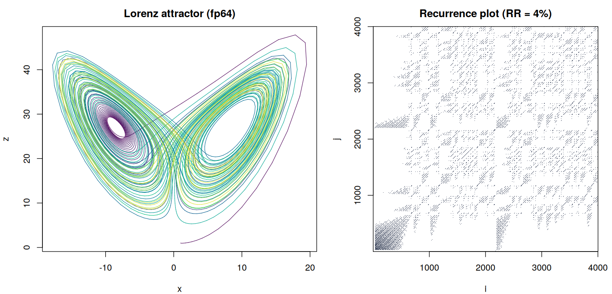

# chaos-rcpp

[](https://github.com/andrii-patrikei/chaos-rcpp/actions/workflows/R-CMD-check.yaml)
[](LICENSE.md)

Chaotic dynamical systems in R with compiled Rcpp kernels, explicit control
over floating-point precision, and Recurrence Quantification Analysis.

The package name is `chaosrcpp` (R does not allow a hyphen in a package name).



The figure above is the reason this package exists. Four Lorenz trajectories
start from the same point and are integrated with the same fourth-order
Runge-Kutta scheme and the same step size. The only difference between them is
the type used for arithmetic: `float` (fp32), `double` (fp64), a double-double
type with about 106 bits (dd), and a 128-bit Rmpfr run that serves as the
reference. Rounding error alone is enough to pull them apart: the distance to
the reference grows as `eps * exp(lambda1 * t)` (dashed lines), where `eps` is
the unit roundoff of each type and `lambda1 = 0.906` is the largest Lyapunov
exponent of the Lorenz system. fp32 has lost the trajectory by `t = 18`,
fp64 by `t = 40`, and dd still tracks the reference to nine decimal places
at `t = 60`.

## Installation

```r
# install.packages("remotes")
remotes::install_github("andrii-patrikei/chaos-rcpp")
```

A C++11 compiler is required (Rtools on Windows, Xcode command line tools on
macOS). Optional packages unlock extra features: `Rmpfr` (the mpfr precision
level and exact high-precision distances), `deSolve` (benchmark), `ggplot2`
and `patchwork` (publication plots), `plotly` (interactive 3D attractors) and
`shiny` (the explorer app).

## Quick start

```r
library(chaosrcpp)

# Lorenz attractor, one million RK4 steps in a few hundredths of a second
tr <- lorenz(n = 1e6, dt = 0.001, thin = 10)
plot(tr, col = hcl.colors(nrow(tr), "Viridis"))

# The same run in single precision, or in double-double
lorenz(n = 5000, precision = "fp32")
lorenz(n = 5000, precision = "dd")

# Precision divergence experiment (the hero figure)
d <- precision_divergence(t_max = 60)
d
plot_divergence(d)     # needs ggplot2 + patchwork

# Lyapunov spectrum by Gram-Schmidt reorthonormalisation
lyapunov_spectrum("lorenz")
#> Lyapunov spectrum (lorenz):
#> [1]   0.9077   0.0008 -14.5750
#>   sum = -13.6666   Kaplan-Yorke dimension = 2.0623

# Recurrence Quantification Analysis of a trajectory
rqa(lorenz(n = 3000, dt = 0.02), rr = 0.05)
#> Recurrence Quantification Analysis (3001 states, eps = 4.524, euclidean norm, m = 1, tau = 1, theiler = 1)
#>       RR      DET        L     Lmax      DIV     ENTR      LAM       TT     Vmax    RATIO
#>   0.0498   0.9991  19.4004 678.0000   0.0015   3.6473   0.9891   5.8354 105.0000  20.0625

# Interactive 3D view (plotly) and the shiny explorer
plot_attractor_3d(lorenz(n = 20000, dt = 0.005))
run_chaos_explorer()
```

## What is inside

### Flows with selectable precision

`lorenz()` and `roessler()` integrate the two classic flows with a fixed-step
RK4 kernel written once as a C++ template and instantiated three times:

| `precision` | type | unit roundoff | speed (1e6 steps) |
|---|---|---|---|
| `"fp32"` | `float` | 6e-8 | about 0.04 s |
| `"fp64"` | `double` | 1.1e-16 | about 0.05 s |
| `"dd"` | double-double (`src/dd.h`) | 5e-32 | about 0.25 s |
| `"mpfr"` | Rmpfr, any number of bits | user chosen | about 110 steps per second |

The double-double type is a header-only implementation of the classical
error-free transformations (Knuth's TwoSum, Dekker's TwoProd via `fma`),
following Hida, Li and Bailey (2001). It is verified against Rmpfr to about
1e-33 relative error. It costs only about five to seven times as much as
`double` (every double-double operation is a short chain of ordinary
floating-point operations, all inlined) and is tens of thousands of times
faster than the interpreted Rmpfr loop, which makes it the practical default
reference for `precision_divergence()`. The Rmpfr path (`precision = "mpfr"`) uses the same
RK4 formulas in R and remains the gold standard for validating everything
else.

High-precision trajectories carry more digits than a `double` can hold, so the
data frame columns are rounded and the full values live in attributes.
`exact_states()` returns them as an Rmpfr matrix so that differences between
precision levels can be computed without losing them to the rounding of the
output itself.

### Lyapunov spectra

`lyapunov_spectrum()` integrates the state together with a full set of tangent
vectors and re-orthonormalises them by Gram-Schmidt after every step
(Benettin et al.). For the classic Lorenz parameters it returns
`(0.906, 0.000, -14.575)`; the exponents sum to the trace of the Jacobian,
`-(sigma + 1 + beta) = -13.667`, which is built in as a self-check.
`kaplan_yorke_dimension()` gives the attractor dimension estimate (2.06 for
Lorenz).

### Maps



* `logistic_orbit()`, `logistic_bifurcation()`, `logistic_lyapunov()`,
  `logistic_cobweb()`: the logistic map with its bifurcation diagram and the
  analytic Lyapunov exponent `mean(log |r (1 - 2x)|)`, which equals `log 2`
  at `r = 4`. `plot_bifurcation()` stacks the two and shades the chaotic
  windows.
* `henon()`, `henon_bifurcation()`: the Henon map, with escape detection.
* `ikeda()`: the Ikeda map.
* `standard_map()`: the Chirikov standard map, many orbits at once, with
  `plot_standard_map()` for the classic island-and-sea picture.





### Recurrence plots and RQA



`recurrence_matrix()` builds the recurrence matrix of a signal, a matrix of
state vectors, or a trajectory from this package, with optional delay
embedding (`m`, `tau`), a choice of norm (Euclidean, maximum, Manhattan) and
a Theiler window. The threshold can be given directly (`eps`) or chosen so
that the recurrence rate hits a target (`rr`). `rqa()` computes the standard
measures in C++ from the diagonal and vertical line-length histograms:

| measure | meaning |
|---|---|
| RR | recurrence rate |
| DET | determinism, fraction of recurrent points on diagonal lines |
| L, Lmax, DIV | mean and maximum diagonal line length, divergence `1 / Lmax` |
| ENTR | Shannon entropy of the diagonal line-length distribution |
| LAM, TT, Vmax | laminarity, trapping time, longest vertical line |
| RATIO | DET / RR |

`rqa_features()` returns the ten measures as a one-row data frame, the shape
needed for feature tables with one row per signal or window. RQA measures
were among the time-series features I used for wearable-sensor movement
classification in Patrikei et al. (2026), *Acta Gymnica* 56, e2026.004
(https://doi.org/10.5507/ag.2026.004); this package is a compact, tested,
standalone implementation of that step. The C++ results
are cross-checked in the test suite against a brute-force R implementation.

### Plots and interactivity

* `plot()` on any trajectory or map (base graphics), `plot_attractor()` with
  per-row colours.
* `plot_attractor_3d()`: interactive plotly 3D view, several trajectories at
  once (for example fp32 and fp64 side by side).
* `plot_divergence()`, `plot_bifurcation()`, `plot_cobweb()`,
  `plot_standard_map()`: ggplot2 figures.
* `run_chaos_explorer()`: a shiny app with a 3D Lorenz tab (including the
  fp32 vs fp64 divergence), a logistic map tab with an `r` slider driving the
  cobweb, orbit and bifurcation views, and a standard map tab.

## Benchmark

`benchmark_lorenz()` times one million Lorenz RK4 steps at `dt = 0.01`
against `deSolve::rk4()` and a pure R loop, and reports the maximum
difference in the states as a correctness check. Numbers below are from a
single shared 2.1 GHz Xeon core and vary by 20 to 30 percent between runs;
expect several times better on a desktop. The chaosrcpp times include
allocating and filling the million-row output matrix.

Benchmark an installed package (`remotes::install_github()` or
`devtools::install()`), not a `devtools::load_all()` session: `load_all()`
compiles the C++ without optimisation (`-O0`), which leaves `double` about
two to three times slower and the double-double kernel about 25 times slower,
because its small operator functions are no longer inlined.

| method | seconds | steps per second | speedup vs deSolve | max abs diff vs fp64 |
|---|---|---|---|---|
| chaosrcpp fp64 | 0.083 | 12,048,193 | 147x | 0 |
| chaosrcpp fp32 | 0.123 | 8,130,081 | 99x | 3.3e-5 |
| deSolve rk4 | 12.200 | 82,082 | 1x | 5.7e-14 |
| pure R loop | 4.860 | 205,634 | 3x | 2.0e-14 |

Two honest notes on this table. First, deSolve is slower than the pure R loop
here only because the benchmark passes it an R function as the right-hand
side, which it must call four times per step; deSolve with a compiled
right-hand side would be in the same league as this package. The point of the
comparison is the cost of the R-level interface, not the quality of deSolve.
Second, the fp64 and pure R results agree to 2e-14 rather than exactly,
because R evaluates `sixth * h * (...)` in a slightly different order; that
2e-14 is itself a small demonstration of the rounding sensitivity the package
is about.

## Design notes

* One RK4 kernel, three instantiations. `rk4_step<T, D>()` in `src/flows.cpp`
  is templated on the scalar type and the dimension, and the Lorenz and
  Roessler right-hand sides are templated structs. Adding a new flow means
  writing one `operator()` and one `jac()`.
* Constants are rounded too. In the fp32 run, `dt`, `beta = 8/3` and
  `0.5 * dt` are all `float`, exactly as they would be in a single-precision
  simulation code. The experiment therefore measures what actually happens
  when a model is run in reduced precision, not just what happens to the
  state vector.
* Rounding error, not truncation error. All precision levels use the same
  step size, so the RK4 truncation error is identical across them and cancels
  in the differences. What remains is purely the effect of finite precision,
  amplified by the positive Lyapunov exponent.
* No precision is lost on the way out. Double-double states are returned to R
  as separate hi and lo columns and reassembled in Rmpfr by `exact_states()`.
  Without this, the dd curve in the hero figure would sit at zero until about
  `t = 40` and then jump, an artefact of rounding the output to `double`.
* Memory-aware RQA. The recurrence matrix costs `N^2` bytes; `rqa()` warns
  above 20,000 states and `recurrence_matrix()` samples pairwise distances to
  choose the threshold instead of forming the full distance matrix.

## Reproducing the figures

```sh
Rscript tools/make-figures.R
```

Regenerates everything in `man/figures/` and saves the benchmark to
`tools/benchmark.rds`. It takes about two minutes, most of it in the Rmpfr
reference run.

## Related work

* [dtwsom](https://github.com/andrii-patrikei/dtwsom): Self-Organizing Maps
  with a dynamic time warping distance for clustering raw time series.

## References

* Lorenz, E. N. (1963). Deterministic nonperiodic flow. *Journal of the
  Atmospheric Sciences*, 20(2), 130-141.
* Benettin, G., Galgani, L., Giorgilli, A., & Strelcyn, J.-M. (1980).
  Lyapunov characteristic exponents for smooth dynamical systems and for
  Hamiltonian systems. *Meccanica*, 15, 9-20.
* Hida, Y., Li, X. S., & Bailey, D. H. (2001). Algorithms for quad-double
  precision floating point arithmetic. *Proceedings of the 15th IEEE
  Symposium on Computer Arithmetic*, 155-162.
* Marwan, N., Romano, M. C., Thiel, M., & Kurths, J. (2007). Recurrence plots
  for the analysis of complex systems. *Physics Reports*, 438(5-6), 237-329.
* Patrikei, A., Cuberek, R., Halfar, R., & Martinovič, T. (2026). Essential
  time series characteristics for human motion analysis based on
  Self-Organizing Map clustering. *Acta Gymnica*, 56, e2026.004.

## License

MIT, see [LICENSE.md](LICENSE.md).
